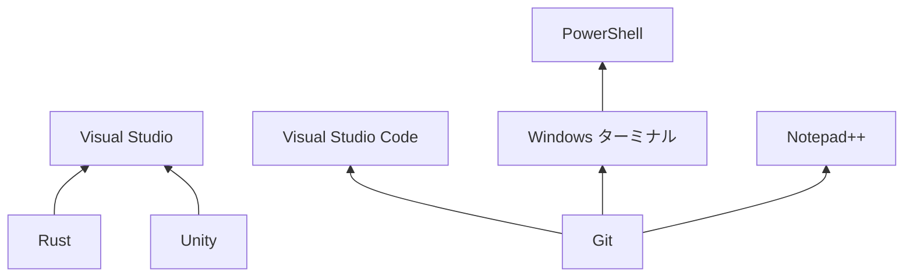

# Windows

1. [PowerShell](https://learn.microsoft.com/ja-jp/powershell/scripting/install/installing-powershell-on-windows)
2. [Visual Studio](https://visualstudio.microsoft.com/ja/vs/)
3. [Visual Studio Code](https://code.visualstudio.com)
4. [Notepad++](https://notepad-plus-plus.org/)
5. [Windows ターミナル](https://learn.microsoft.com/ja-jp/windows/terminal/)
6. [Rust](https://www.rust-lang.org/ja)
7. [Unity](https://unity.com/ja)
8. [Git](https://git-scm.com/)

各種インテグレーションの都合で上記の順でインストールした方が良い。

その他入れておきたいソフトウェア。

* [Bitwarden](https://bitwarden.com/ja-jp/)
* [Discord](https://discord.com/)
* [Firefox](https://www.mozilla.org/ja/firefox/)
